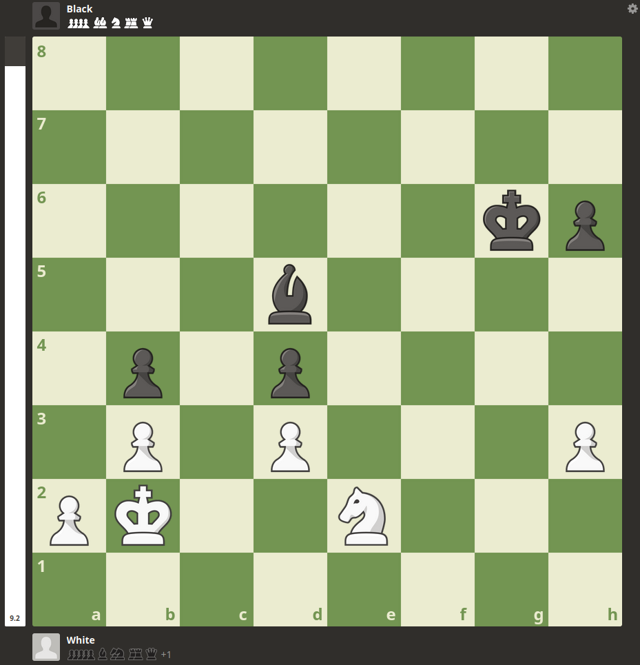
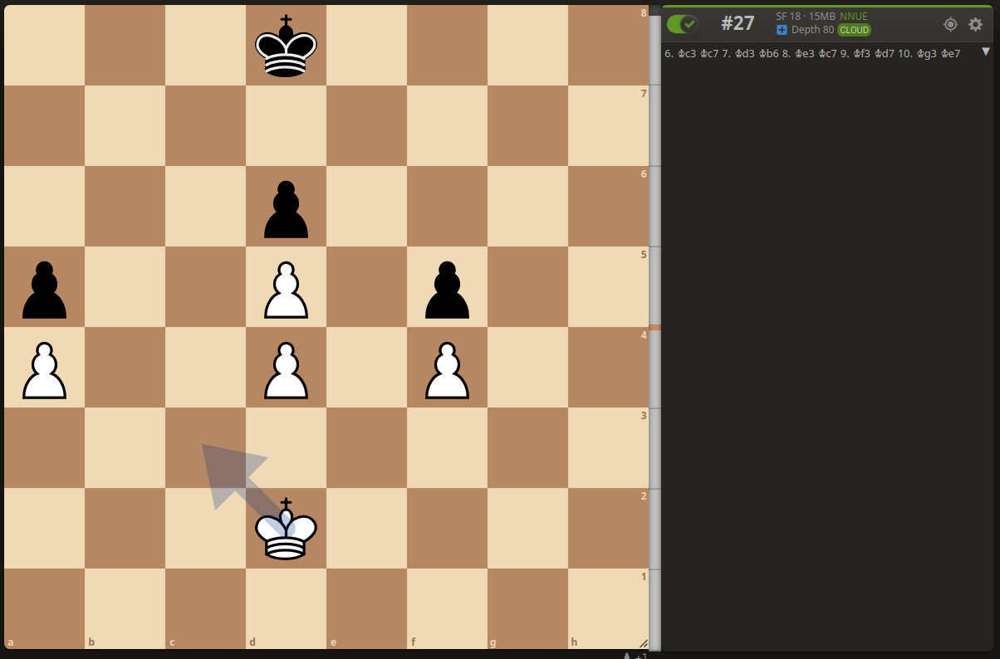

# `puzzle_1` for v1.x

> White to Move
```
dotnet run --project engine_csharp/src/LocalTesting -- puzzle-1 --versions v1 v1.1 v1.2 v1.3 v1.4 --depth 4
dotnet run --project engine_csharp/src/LocalTesting -- puzzle-1 --versions v1.5 --time-limit-seconds 2.7
dotnet run --project engine_csharp/src/LocalTesting -- puzzle-1 --versions v2.0 --time-limit-seconds 0.1
```

```
=== v1 local test at depth 4 ===
Start FEN: 8/8/6kp/3b4/1p1p4/1P1P3P/PK2N3/8 w - - 0 2
White 1: Nf4+ (e2f4) | expected=Nf4+ | match=True | score=-100 | positions=53034 | elapsed=5.868635s
Black forced: Kg7 (g6g7)
White 2: Kc2 (b2c2) | expected=Nxd5 | match=False | score=-100 | positions=44195 | elapsed=4.349277s
White total: positions=97229 | elapsed=10.217911s

=== v1.1 local test at depth 4 ===
Start FEN: 8/8/6kp/3b4/1p1p4/1P1P3P/PK2N3/8 w - - 0 2
White 1: Nf4+ (e2f4) | expected=Nf4+ | match=True | score=400 | positions=6768 | elapsed=0.949762s
Black forced: Kg7 (g6g7)
White 2: Nxd5 (f4d5) | expected=Nxd5 | match=True | score=500 | positions=6499 | elapsed=0.960204s
White total: positions=13267 | elapsed=1.909966s

=== v1.2 local test at depth 4 ===
Start FEN: 8/8/6kp/3b4/1p1p4/1P1P3P/PK2N3/8 w - - 0 2
White 1: Nf4+ (e2f4) | expected=Nf4+ | match=True | score=400 | positions=4801 | elapsed=1.539055s
Black forced: Kg7 (g6g7)
White 2: Nxd5 (f4d5) | expected=Nxd5 | match=True | score=500 | positions=3130 | elapsed=1.203581s
White total: positions=7931 | elapsed=2.742637s

=== v1.3 local test at depth 4 ===
Start FEN: 8/8/6kp/3b4/1p1p4/1P1P3P/PK2N3/8 w - - 0 2
White 1: Nf4+ (e2f4) | expected=Nf4+ | match=True | score=400 | positions=7422 | elapsed=4.033918s
Black forced: Kg7 (g6g7)
White 2: Nxd5 (f4d5) | expected=Nxd5 | match=True | score=500 | positions=4835 | elapsed=3.145556s
White total: positions=12257 | elapsed=7.179474s

=== v1.4 local test at depth 4 ===
Start FEN: 8/8/6kp/3b4/1p1p4/1P1P3P/PK2N3/8 w - - 0 2
White 1: Nf4+ (e2f4) | expected=Nf4+ | match=True | score=400 | positions=5404 | elapsed=2.785468s
Black forced: Kg7 (g6g7)
White 2: Nxd5 (f4d5) | expected=Nxd5 | match=True | score=500 | positions=3402 | elapsed=1.829545s
White total: positions=8806 | elapsed=4.615013s

=== v1.5 local test at time_limit=2.700s ===
Start FEN: 8/8/6kp/3b4/1p1p4/1P1P3P/PK2N3/8 w - - 0 2
White 1: Nf4+ (e2f4) | expected=Nf4+ | match=True | score=400 | positions=4819 | elapsed=2.886224s
White 1 detail: completed_depth=3 | timed_out=True | tt_entries=431 | tt_probes=539 | tt_hits=104 | tt_hit_rate=0.193 | tt_cutoffs=3 | moves_evaluated=2857 | nodes_searched=4819
Black forced: Kg7 (g6g7)
White 2: Nxd5 (f4d5) | expected=Nxd5 | match=True | score=500 | positions=7916 | elapsed=2.985325s
White 2 detail: completed_depth=4 | timed_out=True | tt_entries=673 | tt_probes=1052 | tt_hits=374 | tt_hit_rate=0.356 | tt_cutoffs=63 | moves_evaluated=4866 | nodes_searched=7916
White total: positions=12735 | elapsed=5.871549s

=== v1.6 local test at time_limit=2.700s ===
Start FEN: 8/8/6kp/3b4/1p1p4/1P1P3P/PK2N3/8 w - - 0 2
White 1: Nf4+ (e2f4) | expected=Nf4+ | match=True | score=400 | positions=12288 | elapsed=2.930213s
White 1 detail: completed_depth=4 | timed_out=True | tt_entries=910 | tt_probes=1439 | tt_hits=525 | tt_hit_rate=0.365 | tt_cutoffs=150 | moves_evaluated=7128 | nodes_searched=12288
Black forced: Kg7 (g6g7)
White 2: Nxd5 (f4d5) | expected=Nxd5 | match=True | score=500 | positions=15965 | elapsed=2.812792s
White 2 detail: completed_depth=4 | timed_out=True | tt_entries=2094 | tt_probes=3612 | tt_hits=1507 | tt_hit_rate=0.417 | tt_cutoffs=668 | moves_evaluated=10269 | nodes_searched=15965
White total: positions=28253 | elapsed=5.743005s

=== v2.0 local test at time_limit=0.100s ===
Start FEN: 8/8/6kp/3b4/1p1p4/1P1P3P/PK2N3/8 w - - 0 2
White 1: Nf4+ (e2f4) | expected=Nf4+ | match=True | score=420 | positions=19039 | elapsed=0.111560s
White 1 detail: completed_depth=4 | timed_out=True | tt_entries=1840 | tt_probes=3148 | tt_hits=1301 | tt_hit_rate=0.413 | tt_cutoffs=693 | moves_evaluated=11860 | nodes_searched=19039
Black forced: Kg7 (g6g7)
White 2: Nxd5 (f4d5) | expected=Nxd5 | match=True | score=520 | positions=18220 | elapsed=0.101301s
White 2 detail: completed_depth=4 | timed_out=True | tt_entries=2226 | tt_probes=3773 | tt_hits=1521 | tt_hit_rate=0.403 | tt_cutoffs=843 | moves_evaluated=11855 | nodes_searched=18220
White total: positions=37259 | elapsed=0.212862s
```

# `puzzle_2` for v2.0

> White to Move
```
dotnet run --project engine_csharp/src/LocalTesting -- puzzle-2 --version v2.0 --time-limit-seconds 2.0 --max-plies 60
```

```
=== v2.0 puzzle_2 local self-play at time_limit=2.000s ===
Start FEN: 3k4/8/3p4/p2P1p2/P2P1P2/8/3K4/8 w - - 10 6
Start turn: white | max_plies=60
White 1: Kc3 (d2c3) | expected=Kc3 | match=True | score=200 | positions=500736 | elapsed=2.011005s
White 1 detail: completed_depth=22 | timed_out=True | tt_entries=36914 | tt_probes=280220 | tt_hits=236755 | tt_hit_rate=0.845 | tt_cutoffs=155391 | moves_evaluated=395820 | nodes_searched=500736
Ply 2: black to move | legal_moves=5 | time_limit=2.000s | search started
Ply 2: black plays Kc7 (d8c7) | score=-200 | positions=515072 | elapsed=2.000435s
Ply 2 detail: completed_depth=21 | timed_out=True | tt_entries=40354 | tt_probes=255910 | tt_hits=208289 | tt_hit_rate=0.814 | tt_cutoffs=135773 | moves_evaluated=391256 | nodes_searched=515072
Ply 3: white to move | legal_moves=6 | time_limit=2.000s | search started
Ply 3: white plays Kd3 (c3d3) | score=200 | positions=523264 | elapsed=2.001968s
Ply 3 detail: completed_depth=26 | timed_out=True | tt_entries=40660 | tt_probes=297555 | tt_hits=249738 | tt_hit_rate=0.839 | tt_cutoffs=164535 | moves_evaluated=415500 | nodes_searched=523264
Ply 4: black to move | legal_moves=6 | time_limit=2.000s | search started
Ply 4: black plays Kb6 (c7b6) | score=-200 | positions=561152 | elapsed=2.001006s
Ply 4 detail: completed_depth=23 | timed_out=True | tt_entries=41537 | tt_probes=296411 | tt_hits=247116 | tt_hit_rate=0.834 | tt_cutoffs=160058 | moves_evaluated=434323 | nodes_searched=561152
Ply 5: white to move | legal_moves=6 | time_limit=2.000s | search started
Ply 5: white plays Ke2 (d3e2) | score=200 | positions=541696 | elapsed=2.002127s
Ply 5 detail: completed_depth=24 | timed_out=True | tt_entries=32739 | tt_probes=308375 | tt_hits=269500 | tt_hit_rate=0.874 | tt_cutoffs=170004 | moves_evaluated=431078 | nodes_searched=541696
Ply 6: black to move | legal_moves=4 | time_limit=2.000s | search started
Ply 6: black plays Kc7 (b6c7) | score=-200 | positions=517120 | elapsed=2.000833s
Ply 6 detail: completed_depth=24 | timed_out=True | tt_entries=35770 | tt_probes=243877 | tt_hits=201388 | tt_hit_rate=0.826 | tt_cutoffs=132406 | moves_evaluated=386247 | nodes_searched=517120
Ply 7: white to move | legal_moves=8 | time_limit=2.000s | search started
Ply 7: white plays Kf2 (e2f2) | score=200 | positions=506880 | elapsed=2.004475s
Ply 7 detail: completed_depth=23 | timed_out=True | tt_entries=29085 | tt_probes=313156 | tt_hits=278797 | tt_hit_rate=0.890 | tt_cutoffs=177046 | moves_evaluated=414223 | nodes_searched=506880
Ply 8: black to move | legal_moves=6 | time_limit=2.000s | search started
Ply 8: black plays Kd7 (c7d7) | score=-200 | positions=539648 | elapsed=2.002820s
Ply 8 detail: completed_depth=23 | timed_out=True | tt_entries=35788 | tt_probes=307368 | tt_hits=263752 | tt_hit_rate=0.858 | tt_cutoffs=168198 | moves_evaluated=428644 | nodes_searched=539648
Ply 9: white to move | legal_moves=8 | time_limit=2.000s | search started
Ply 9: white plays Kg3 (f2g3) | score=200 | positions=585728 | elapsed=2.004162s
Ply 9 detail: completed_depth=23 | timed_out=True | tt_entries=43621 | tt_probes=318362 | tt_hits=264220 | tt_hit_rate=0.830 | tt_cutoffs=175018 | moves_evaluated=458604 | nodes_searched=585728
Ply 10: black to move | legal_moves=5 | time_limit=2.000s | search started
Ply 10: black plays Ke7 (d7e7) | score=-200 | positions=574464 | elapsed=2.003005s
Ply 10 detail: completed_depth=21 | timed_out=True | tt_entries=36624 | tt_probes=295722 | tt_hits=251314 | tt_hit_rate=0.850 | tt_cutoffs=161633 | moves_evaluated=440968 | nodes_searched=574464
Ply 11: white to move | legal_moves=6 | time_limit=2.000s | search started
Ply 11: white plays Kh4 (g3h4) | score=200 | positions=580608 | elapsed=2.001925s
Ply 11 detail: completed_depth=22 | timed_out=True | tt_entries=44235 | tt_probes=312807 | tt_hits=256796 | tt_hit_rate=0.821 | tt_cutoffs=170251 | moves_evaluated=455193 | nodes_searched=580608
Ply 12: black to move | legal_moves=6 | time_limit=2.000s | search started
Ply 12: black plays Kf6 (e7f6) | score=-200 | positions=547840 | elapsed=2.000374s
Ply 12 detail: completed_depth=20 | timed_out=True | tt_entries=41897 | tt_probes=295853 | tt_hits=245336 | tt_hit_rate=0.829 | tt_cutoffs=159776 | moves_evaluated=428137 | nodes_searched=547840
Ply 13: white to move | legal_moves=3 | time_limit=2.000s | search started
Ply 13: white plays Kh5 (h4h5) | score=300 | positions=506880 | elapsed=2.003658s
Ply 13 detail: completed_depth=22 | timed_out=True | tt_entries=37675 | tt_probes=281585 | tt_hits=236307 | tt_hit_rate=0.839 | tt_cutoffs=154227 | moves_evaluated=401400 | nodes_searched=506880
Ply 14: black to move | legal_moves=3 | time_limit=2.000s | search started
Ply 14: black plays Kf7 (f6f7) | score=-200 | positions=472064 | elapsed=2.001444s
Ply 14 detail: completed_depth=19 | timed_out=True | tt_entries=33871 | tt_probes=234352 | tt_hits=193757 | tt_hit_rate=0.827 | tt_cutoffs=123580 | moves_evaluated=359292 | nodes_searched=472064
Ply 15: white to move | legal_moves=3 | time_limit=2.000s | search started
Ply 15: white plays Kg5 (h5g5) | score=200 | positions=529408 | elapsed=2.005748s
Ply 15 detail: completed_depth=20 | timed_out=True | tt_entries=37558 | tt_probes=233373 | tt_hits=189098 | tt_hit_rate=0.810 | tt_cutoffs=127385 | moves_evaluated=391430 | nodes_searched=529408
Ply 16: black to move | legal_moves=5 | time_limit=2.000s | search started
Ply 16: black plays Kg7 (f7g7) | score=-300 | positions=516096 | elapsed=2.001739s
Ply 16 detail: completed_depth=19 | timed_out=True | tt_entries=41933 | tt_probes=261025 | tt_hits=210034 | tt_hit_rate=0.805 | tt_cutoffs=138297 | moves_evaluated=395076 | nodes_searched=516096
Ply 17: white to move | legal_moves=3 | time_limit=2.000s | search started
Ply 17: white plays Kxf5 (g5f5) | score=200 | positions=536576 | elapsed=2.004136s
Ply 17 detail: completed_depth=19 | timed_out=True | tt_entries=42122 | tt_probes=234293 | tt_hits=184711 | tt_hit_rate=0.788 | tt_cutoffs=126235 | moves_evaluated=395909 | nodes_searched=536576
Ply 18: black to move | legal_moves=6 | time_limit=2.000s | search started
Ply 18: black plays Kf7 (g7f7) | score=-300 | positions=536576 | elapsed=2.002343s
Ply 18 detail: completed_depth=16 | timed_out=True | tt_entries=39505 | tt_probes=216637 | tt_hits=169604 | tt_hit_rate=0.783 | tt_cutoffs=109608 | moves_evaluated=384798 | nodes_searched=536576
Ply 19: white to move | legal_moves=3 | time_limit=2.000s | search started
Ply 19: white plays Kg5 (f5g5) | score=235 | positions=532480 | elapsed=2.001085s
Ply 19 detail: completed_depth=18 | timed_out=True | tt_entries=39108 | tt_probes=239619 | tt_hits=193549 | tt_hit_rate=0.808 | tt_cutoffs=131294 | moves_evaluated=395486 | nodes_searched=532480
Ply 20: black to move | legal_moves=5 | time_limit=2.000s | search started
Ply 20: black plays Kg7 (f7g7) | score=-300 | positions=518144 | elapsed=2.000589s
Ply 20 detail: completed_depth=17 | timed_out=True | tt_entries=39059 | tt_probes=219356 | tt_hits=173150 | tt_hit_rate=0.789 | tt_cutoffs=114086 | moves_evaluated=376744 | nodes_searched=518144
Ply 21: white to move | legal_moves=5 | time_limit=2.000s | search started
Ply 21: white plays f5 (f4f5) | score=445 | positions=531456 | elapsed=2.004655s
Ply 21 detail: completed_depth=18 | timed_out=True | tt_entries=38752 | tt_probes=272679 | tt_hits=225870 | tt_hit_rate=0.828 | tt_cutoffs=153121 | moves_evaluated=409404 | nodes_searched=531456
Ply 22: black to move | legal_moves=5 | time_limit=2.000s | search started
Ply 22: black plays Kf7 (g7f7) | score=-300 | positions=450560 | elapsed=2.001351s
Ply 22 detail: completed_depth=16 | timed_out=True | tt_entries=31320 | tt_probes=149947 | tt_hits=114271 | tt_hit_rate=0.762 | tt_cutoffs=75578 | moves_evaluated=309588 | nodes_searched=450560
Ply 23: white to move | legal_moves=6 | time_limit=2.000s | search started
Ply 23: white plays f6 (f5f6) | score=1139 | positions=495616 | elapsed=2.001952s
Ply 23 detail: completed_depth=19 | timed_out=True | tt_entries=36855 | tt_probes=299029 | tt_hits=254969 | tt_hit_rate=0.853 | tt_cutoffs=170246 | moves_evaluated=402118 | nodes_searched=495616
Ply 24: black to move | legal_moves=3 | time_limit=2.000s | search started
Ply 24: black plays Kf8 (f7f8) | score=-300 | positions=536576 | elapsed=2.004278s
Ply 24 detail: completed_depth=15 | timed_out=True | tt_entries=25151 | tt_probes=154214 | tt_hits=124366 | tt_hit_rate=0.806 | tt_cutoffs=90433 | moves_evaluated=356179 | nodes_searched=536576
Ply 25: white to move | legal_moves=8 | time_limit=2.000s | search started
Ply 25: white plays Kf4 (g5f4) | score=1139 | positions=474112 | elapsed=2.000968s
Ply 25 detail: completed_depth=20 | timed_out=True | tt_entries=29983 | tt_probes=222051 | tt_hits=187843 | tt_hit_rate=0.846 | tt_cutoffs=118697 | moves_evaluated=357754 | nodes_searched=474112
Ply 26: black to move | legal_moves=3 | time_limit=2.000s | search started
Ply 26: black plays Ke8 (f8e8) | score=-1187 | positions=456704 | elapsed=2.000340s
Ply 26 detail: completed_depth=19 | timed_out=True | tt_entries=35039 | tt_probes=158257 | tt_hits=118536 | tt_hit_rate=0.749 | tt_cutoffs=74285 | moves_evaluated=316248 | nodes_searched=456704
Ply 27: white to move | legal_moves=8 | time_limit=2.000s | search started
Ply 27: white plays Kg4 (f4g4) | score=994 | positions=496640 | elapsed=2.001471s
Ply 27 detail: completed_depth=17 | timed_out=True | tt_entries=51548 | tt_probes=329476 | tt_hits=264614 | tt_hit_rate=0.803 | tt_cutoffs=203241 | moves_evaluated=416154 | nodes_searched=496640
Ply 28: black to move | legal_moves=4 | time_limit=2.000s | search started
Ply 28: black plays Kf8 (e8f8) | score=-994 | positions=509952 | elapsed=2.001135s
Ply 28 detail: completed_depth=15 | timed_out=True | tt_entries=26398 | tt_probes=139149 | tt_hits=109812 | tt_hit_rate=0.789 | tt_cutoffs=75921 | moves_evaluated=332413 | nodes_searched=509952
Ply 29: white to move | legal_moves=9 | time_limit=2.000s | search started
Ply 29: white plays Kg5 (g4g5) | score=994 | positions=504832 | elapsed=2.003237s
Ply 29 detail: completed_depth=16 | timed_out=True | tt_entries=23843 | tt_probes=134614 | tt_hits=108141 | tt_hit_rate=0.803 | tt_cutoffs=69552 | moves_evaluated=329991 | nodes_searched=504832
Ply 30: black to move | legal_moves=3 | time_limit=2.000s | search started
Ply 30: black plays Kf7 (f8f7) | score=-994 | positions=519168 | elapsed=2.003316s
Ply 30 detail: completed_depth=15 | timed_out=True | tt_entries=34616 | tt_probes=195941 | tt_hits=154083 | tt_hit_rate=0.786 | tt_cutoffs=113251 | moves_evaluated=365623 | nodes_searched=519168
Ply 31: white to move | legal_moves=6 | time_limit=2.000s | search started
Ply 31: white plays Kf5 (g5f5) | score=1178 | positions=492544 | elapsed=2.000970s
Ply 31 detail: completed_depth=16 | timed_out=True | tt_entries=29049 | tt_probes=158339 | tt_hits=125880 | tt_hit_rate=0.795 | tt_cutoffs=77219 | moves_evaluated=334756 | nodes_searched=492544
Ply 32: black to move | legal_moves=3 | time_limit=2.000s | search started
Ply 32: black plays Kf8 (f7f8) | score=-1178 | positions=498688 | elapsed=2.002159s
Ply 32 detail: completed_depth=15 | timed_out=True | tt_entries=41436 | tt_probes=183115 | tt_hits=133792 | tt_hit_rate=0.731 | tt_cutoffs=95574 | moves_evaluated=349180 | nodes_searched=498688
Ply 33: white to move | legal_moves=7 | time_limit=2.000s | search started
Ply 33: white plays Ke6 (f5e6) | score=1205 | positions=505856 | elapsed=2.002214s
Ply 33 detail: completed_depth=16 | timed_out=True | tt_entries=36187 | tt_probes=164930 | tt_hits=123642 | tt_hit_rate=0.750 | tt_cutoffs=80234 | moves_evaluated=344098 | nodes_searched=505856
Ply 34: black to move | legal_moves=2 | time_limit=2.000s | search started
Ply 34: black plays Ke8 (f8e8) | score=-1178 | positions=416768 | elapsed=2.003698s
Ply 34 detail: completed_depth=13 | timed_out=True | tt_entries=21393 | tt_probes=74675 | tt_hits=51414 | tt_hit_rate=0.689 | tt_cutoffs=30920 | moves_evaluated=257881 | nodes_searched=416768
Ply 35: white to move | legal_moves=3 | time_limit=2.000s | search started
Ply 35: white plays Kxd6 (e6d6) | score=1900 | positions=505856 | elapsed=2.003099s
Ply 35 detail: completed_depth=15 | timed_out=True | tt_entries=32906 | tt_probes=127360 | tt_hits=90219 | tt_hit_rate=0.708 | tt_cutoffs=56521 | moves_evaluated=327242 | nodes_searched=505856
Ply 36: black to move | legal_moves=3 | time_limit=2.000s | search started
Ply 36: black plays Kf7 (e8f7) | score=-1376 | positions=546816 | elapsed=2.004093s
Ply 36 detail: completed_depth=13 | timed_out=True | tt_entries=27968 | tt_probes=110368 | tt_hits=78826 | tt_hit_rate=0.714 | tt_cutoffs=43598 | moves_evaluated=372656 | nodes_searched=546816
Ply 37: white to move | legal_moves=5 | time_limit=2.000s | search started
Ply 37: white plays Ke5 (d6e5) | score=1202 | positions=467968 | elapsed=2.004973s
Ply 37 detail: completed_depth=12 | timed_out=True | tt_entries=31579 | tt_probes=109532 | tt_hits=74427 | tt_hit_rate=0.680 | tt_cutoffs=45776 | moves_evaluated=300461 | nodes_searched=467968
Ply 38: black to move | legal_moves=4 | time_limit=2.000s | search started
Ply 38: black plays Kf8 (f7f8) | score=-1226 | positions=523264 | elapsed=2.003593s
Ply 38 detail: completed_depth=11 | timed_out=True | tt_entries=26819 | tt_probes=89854 | tt_hits=59890 | tt_hit_rate=0.667 | tt_cutoffs=34744 | moves_evaluated=328659 | nodes_searched=523264
Ply 39: white to move | legal_moves=7 | time_limit=2.000s | search started
Ply 39: white plays d6 (d5d6) | score=1900 | positions=522240 | elapsed=2.001506s
Ply 39 detail: completed_depth=12 | timed_out=True | tt_entries=30727 | tt_probes=126276 | tt_hits=91376 | tt_hit_rate=0.724 | tt_cutoffs=57156 | moves_evaluated=335520 | nodes_searched=522240
Ply 40: black to move | legal_moves=3 | time_limit=2.000s | search started
Ply 40: black plays Ke8 (f8e8) | score=-1900 | positions=487424 | elapsed=2.000725s
Ply 40 detail: completed_depth=11 | timed_out=True | tt_entries=33029 | tt_probes=107195 | tt_hits=69726 | tt_hit_rate=0.650 | tt_cutoffs=42360 | moves_evaluated=322035 | nodes_searched=487424
Ply 41: white to move | legal_moves=8 | time_limit=2.000s | search started
Ply 41: white plays Ke6 (e5e6) | score=1900 | positions=457728 | elapsed=2.004523s
Ply 41 detail: completed_depth=10 | timed_out=True | tt_entries=23362 | tt_probes=69650 | tt_hits=44151 | tt_hit_rate=0.634 | tt_cutoffs=25351 | moves_evaluated=276798 | nodes_searched=457728
Ply 42: black to move | legal_moves=2 | time_limit=2.000s | search started
Ply 42: black plays Kd8 (e8d8) | score=-999988 | positions=786432 | elapsed=2.001750s
Ply 42 detail: completed_depth=13 | timed_out=True | tt_entries=22659 | tt_probes=176567 | tt_hits=146075 | tt_hit_rate=0.827 | tt_cutoffs=84907 | moves_evaluated=739180 | nodes_searched=786432
Ply 43: white to move | legal_moves=7 | time_limit=2.000s | search started
Ply 43: white plays f7 (f6f7) | score=999989 | positions=599040 | elapsed=2.001246s
Ply 43 detail: completed_depth=10 | timed_out=True | tt_entries=30818 | tt_probes=127648 | tt_hits=91261 | tt_hit_rate=0.715 | tt_cutoffs=57588 | moves_evaluated=452289 | nodes_searched=599040
Ply 44: black to move | legal_moves=1 | time_limit=2.000s | search started
Ply 44: black plays Kc8 (d8c8) | score=-999990 | positions=885760 | elapsed=2.001972s
Ply 44 detail: completed_depth=14 | timed_out=True | tt_entries=14559 | tt_probes=185434 | tt_hits=164478 | tt_hit_rate=0.887 | tt_cutoffs=94088 | moves_evaluated=853302 | nodes_searched=885760
Ply 45: white to move | legal_moves=11 | time_limit=2.000s | search started
Ply 45: white plays f8=Q+ (f7f8q) | score=999991 | positions=586752 | elapsed=2.001848s
Ply 45 detail: completed_depth=8 | timed_out=True | tt_entries=21551 | tt_probes=96697 | tt_hits=71897 | tt_hit_rate=0.744 | tt_cutoffs=44107 | moves_evaluated=405716 | nodes_searched=586752
Ply 46: black to move | legal_moves=1 | time_limit=2.000s | search started
Ply 46: black plays Kb7 (c8b7) | score=-999992 | positions=903168 | elapsed=2.000556s
Ply 46 detail: completed_depth=20 | timed_out=True | tt_entries=5910 | tt_probes=182867 | tt_hits=172166 | tt_hit_rate=0.941 | tt_cutoffs=101433 | moves_evaluated=889152 | nodes_searched=903168
Ply 47: white to move | legal_moves=26 | time_limit=2.000s | search started
Ply 47: white plays d7 (d6d7) | score=999993 | positions=507904 | elapsed=2.003840s
Ply 47 detail: completed_depth=7 | timed_out=True | tt_entries=23772 | tt_probes=123365 | tt_hits=95410 | tt_hit_rate=0.773 | tt_cutoffs=72171 | moves_evaluated=349122 | nodes_searched=507904
Ply 48: black to move | legal_moves=5 | time_limit=2.000s | search started
Ply 48: black plays Ka7 (b7a7) | score=-999994 | positions=932864 | elapsed=2.001524s
Ply 48 detail: completed_depth=62 | timed_out=True | tt_entries=1249 | tt_probes=103372 | tt_hits=99899 | tt_hit_rate=0.966 | tt_cutoffs=30630 | moves_evaluated=929767 | nodes_searched=932864
Ply 49: white to move | legal_moves=33 | time_limit=2.000s | search started
Ply 49: white plays d8=Q (d7d8q) | score=999995 | positions=673792 | elapsed=2.002045s
Ply 49 detail: completed_depth=8 | timed_out=True | tt_entries=15660 | tt_probes=87315 | tt_hits=67526 | tt_hit_rate=0.773 | tt_cutoffs=35362 | moves_evaluated=569716 | nodes_searched=673792
Ply 50: black to move | legal_moves=2 | time_limit=2.000s | search started
Ply 50: black plays Ka6 (a7a6) | score=-999996 | positions=1036288 | elapsed=2.000514s
Ply 50 detail: completed_depth=361 | timed_out=True | tt_entries=149 | tt_probes=58161 | tt_hits=55139 | tt_hit_rate=0.948 | tt_cutoffs=2148 | moves_evaluated=1035453 | nodes_searched=1036288
Ply 51: white to move | legal_moves=40 | time_limit=2.000s | search started
Ply 51: white plays Qc8+ (d8c8) | score=999997 | positions=697344 | elapsed=2.002178s
Ply 51 detail: completed_depth=9 | timed_out=True | tt_entries=22241 | tt_probes=105764 | tt_hits=79953 | tt_hit_rate=0.756 | tt_cutoffs=51403 | moves_evaluated=577428 | nodes_searched=697344
Ply 52: black to move | legal_moves=2 | time_limit=2.000s | search started
Ply 52: black plays Ka7 (a6a7) | score=-999998 | positions=1066205 | elapsed=2.000270s
Ply 52 detail: completed_depth=12693 | timed_out=True | tt_entries=3 | tt_probes=63460 | tt_hits=38075 | tt_hit_rate=0.600 | tt_cutoffs=0 | moves_evaluated=1066147 | nodes_searched=1066205
Ply 53: white to move | legal_moves=41 | time_limit=2.000s | search started
Ply 53: white plays Qfc5# (f8c5) | score=999999 | positions=708608 | elapsed=2.003910s
Ply 53 detail: completed_depth=10 | timed_out=True | tt_entries=16266 | tt_probes=134516 | tt_hits=113514 | tt_hit_rate=0.844 | tt_cutoffs=72477 | moves_evaluated=620572 | nodes_searched=708608

Final FEN: 2Q5/k7/4K3/p1Q5/P2P4/8/8/8 b - - 4 32
Total positions: 30427357
Total elapsed: 106.130784s
Total TT probes: 10267673
Total TT hits: 8324452
Total TT cutoffs: 5334893
Outcome: checkmate
Winner: white
Repetition detected: False
White delivered mate within ply limit: True
```

# `endgame_1` for v1.4

> Black to Move
```
dotnet run --project engine_csharp/src/LocalTesting -- endgame-1
dotnet run --project engine_csharp/src/LocalTesting -- endgame-1 --version v2.0 --time-limit-seconds 0.1
```

```
=== v1.4 endgame local self-play at depth 4 ===
Start FEN: 3r4/3r4/3k4/8/3K4/8/8/8 b - - 1 1
Start turn: black | max_plies=60
Ply 1: black to move | legal_moves=18 | depth=4 | search started
Ply 1: black plays Ke6+ (d6e6) | score=1134 | positions=3150 | elapsed=4.723562s
Ply 2: white to move | legal_moves=5 | depth=4 | search started
Ply 2: white plays Ke3 (d4e3) | score=-1150 | positions=5950 | elapsed=2.868440s
Ply 3: black to move | legal_moves=27 | depth=4 | search started
Ply 3: black plays Kf5 (e6f5) | score=1150 | positions=3643 | elapsed=4.446135s
Ply 4: white to move | legal_moves=3 | depth=4 | search started
Ply 4: white plays Kf3 (e3f3) | score=-1179 | positions=3523 | elapsed=1.544930s
Ply 5: black to move | legal_moves=25 | depth=4 | search started
Ply 5: black plays Rd2 (d7d2) | score=1179 | positions=5910 | elapsed=7.033898s
Ply 6: white to move | legal_moves=2 | depth=4 | search started
Ply 6: white plays Kg3 (f3g3) | score=-1000000000 | positions=184 | elapsed=0.086730s
Ply 7: black to move | legal_moves=31 | depth=4 | search started
Ply 7: black plays R8d3+ (d8d3) | score=1000000000 | positions=5343 | elapsed=6.053802s
Ply 8: white to move | legal_moves=1 | depth=4 | search started
Ply 8: white plays Kh4 (g3h4) | score=-1000000000 | positions=2 | elapsed=0.000926s
Ply 9: black to move | legal_moves=26 | depth=4 | search started
Ply 9: black plays Rh2# (d2h2) | score=1000000000 | positions=1502 | elapsed=1.623343s

Final FEN: 8/8/8/5k2/7K/3r4/7r/8 w - - 10 6
Total positions: 29207
Outcome: checkmate
Winner: black
Repetition detected: False
Black delivered mate without repetition: True

=== v2.0 endgame local self-play at time_limit=0.100s ===
Start FEN: 3r4/3r4/3k4/8/3K4/8/8/8 b - - 1 1
Start turn: black | max_plies=60
Ply 1: black to move | legal_moves=18 | time_limit=0.100s | search started
Ply 1: black plays Ke6+ (d6e6) | score=1134 | positions=14719 | elapsed=0.105688s
Ply 1 detail: completed_depth=4 | timed_out=True | tt_entries=1239 | tt_probes=1860 | tt_hits=617 | tt_hit_rate=0.332 | tt_cutoffs=374 | moves_evaluated=8873 | nodes_searched=14719
Ply 2: white to move | legal_moves=5 | time_limit=0.100s | search started
Ply 2: white plays Ke3 (d4e3) | score=-1150 | positions=16981 | elapsed=0.101038s
Ply 2 detail: completed_depth=4 | timed_out=True | tt_entries=1750 | tt_probes=2907 | tt_hits=1155 | tt_hit_rate=0.397 | tt_cutoffs=828 | moves_evaluated=10424 | nodes_searched=16981
Ply 3: black to move | legal_moves=27 | time_limit=0.100s | search started
Ply 3: black plays Kf5 (e6f5) | score=1150 | positions=16384 | elapsed=0.104402s
Ply 3 detail: completed_depth=4 | timed_out=True | tt_entries=1456 | tt_probes=2257 | tt_hits=798 | tt_hit_rate=0.354 | tt_cutoffs=427 | moves_evaluated=9751 | nodes_searched=16384
Ply 4: white to move | legal_moves=3 | time_limit=0.100s | search started
Ply 4: white plays Kf2 (e3f2) | score=-1179 | positions=29696 | elapsed=0.100573s
Ply 4 detail: completed_depth=5 | timed_out=True | tt_entries=1865 | tt_probes=4188 | tt_hits=2282 | tt_hit_rate=0.545 | tt_cutoffs=1308 | moves_evaluated=26040 | nodes_searched=29696
Ply 5: black to move | legal_moves=28 | time_limit=0.100s | search started
Ply 5: black plays Rd2+ (d7d2) | score=1179 | positions=16384 | elapsed=0.101413s
Ply 5 detail: completed_depth=3 | timed_out=True | tt_entries=2100 | tt_probes=3146 | tt_hits=1025 | tt_hit_rate=0.326 | tt_cutoffs=651 | moves_evaluated=10084 | nodes_searched=16384
Ply 6: white to move | legal_moves=6 | time_limit=0.100s | search started
Ply 6: white plays Kg3 (f2g3) | score=-999996 | positions=45818 | elapsed=0.101917s
Ply 6 detail: completed_depth=15 | timed_out=True | tt_entries=244 | tt_probes=3508 | tt_hits=3182 | tt_hit_rate=0.907 | tt_cutoffs=285 | moves_evaluated=45107 | nodes_searched=45818
Ply 7: black to move | legal_moves=31 | time_limit=0.100s | search started
Ply 7: black plays R8d3+ (d8d3) | score=999997 | positions=18432 | elapsed=0.101896s
Ply 7 detail: completed_depth=4 | timed_out=True | tt_entries=1524 | tt_probes=2262 | tt_hits=720 | tt_hit_rate=0.318 | tt_cutoffs=302 | moves_evaluated=11230 | nodes_searched=18432
Ply 8: white to move | legal_moves=1 | time_limit=0.100s | search started
Ply 8: white plays Kh4 (g3h4) | score=-999998 | positions=40960 | elapsed=0.100502s
Ply 8 detail: completed_depth=1517 | timed_out=True | tt_entries=2 | tt_probes=4551 | tt_hits=3033 | tt_hit_rate=0.666 | tt_cutoffs=0 | moves_evaluated=40955 | nodes_searched=40960
Ply 9: black to move | legal_moves=26 | time_limit=0.100s | search started
Ply 9: black plays Rh2# (d2h2) | score=999999 | positions=19318 | elapsed=0.106233s
Ply 9 detail: completed_depth=4 | timed_out=True | tt_entries=708 | tt_probes=1243 | tt_hits=497 | tt_hit_rate=0.400 | tt_cutoffs=73 | moves_evaluated=11806 | nodes_searched=19318

Final FEN: 8/8/8/5k2/7K/3r4/7r/8 w - - 10 6
Total positions: 218692
Total elapsed: 0.923662s
Total TT probes: 25922
Total TT hits: 13309
Total TT cutoffs: 4248
Outcome: checkmate
Winner: black
Repetition detected: False
Black delivered mate without repetition: True
```

# `endgame_2` for v1.4

> Black to Move
```
dotnet run --project engine_csharp/src/LocalTesting -- endgame-2
dotnet run --project engine_csharp/src/LocalTesting -- endgame-2 --version v2.0 --time-limit-seconds 0.5
```

```
=== v1.4 endgame local self-play at depth 4 ===
Start FEN: 3r4/8/3k4/8/3K4/8/8/8 b - - 1 1
Start turn: black | max_plies=60
Ply 1: black to move | legal_moves=13 | depth=4 | search started
Ply 1: black plays Re8 (d8e8) | score=672 | positions=1829 | elapsed=2.223313s
Ply 2: white to move | legal_moves=3 | depth=4 | search started
Ply 2: white plays Kc3 (d4c3) | score=-691 | positions=2942 | elapsed=1.140416s
Ply 3: black to move | legal_moves=22 | depth=4 | search started
Ply 3: black plays Kc5 (d6c5) | score=687 | positions=3303 | elapsed=2.366990s
Ply 4: white to move | legal_moves=5 | depth=4 | search started
Ply 4: white plays Kd3 (c3d3) | score=-717 | positions=3190 | elapsed=1.219016s
Ply 5: black to move | legal_moves=20 | depth=4 | search started
Ply 5: black plays Kd5 (c5d5) | score=696 | positions=2412 | elapsed=1.906752s
Ply 6: white to move | legal_moves=3 | depth=4 | search started
Ply 6: white plays Kc3 (d3c3) | score=-720 | positions=2510 | elapsed=0.951550s
Ply 7: black to move | legal_moves=20 | depth=4 | search started
Ply 7: black plays Re3+ (e8e3) | score=703 | positions=2414 | elapsed=1.696461s
Ply 8: white to move | legal_moves=4 | depth=4 | search started
Ply 8: white plays Kc2 (c3c2) | score=-726 | positions=2426 | elapsed=0.865571s
Ply 9: black to move | legal_moves=22 | depth=4 | search started
Ply 9: black plays Kc4 (d5c4) | score=719 | positions=2859 | elapsed=1.889988s
Ply 10: white to move | legal_moves=5 | depth=4 | search started
Ply 10: white plays Kd2 (c2d2) | score=-755 | positions=2730 | elapsed=0.849643s
Ply 11: black to move | legal_moves=20 | depth=4 | search started
Ply 11: black plays Re8 (e3e8) | score=737 | positions=1760 | elapsed=1.153618s
Ply 12: white to move | legal_moves=3 | depth=4 | search started
Ply 12: white plays Kc1 (d2c1) | score=-767 | positions=1540 | elapsed=0.506498s
Ply 13: black to move | legal_moves=22 | depth=4 | search started
Ply 13: black plays Kc3 (c4c3) | score=781 | positions=2196 | elapsed=1.520087s
Ply 14: white to move | legal_moves=2 | depth=4 | search started
Ply 14: white plays Kd1 (c1d1) | score=-1000000000 | positions=207 | elapsed=0.065502s
Ply 15: black to move | legal_moves=20 | depth=4 | search started
Ply 15: black plays Re3 (e8e3) | score=1000000000 | positions=946 | elapsed=0.707928s
Ply 16: white to move | legal_moves=1 | depth=4 | search started
Ply 16: white plays Kc1 (d1c1) | score=-1000000000 | positions=2 | elapsed=0.000634s
Ply 17: black to move | legal_moves=16 | depth=4 | search started
Ply 17: black plays Re1# (e3e1) | score=1000000000 | positions=908 | elapsed=0.572590s

Final FEN: 8/8/8/8/8/2k5/8/2K1r3 w - - 18 10
Total positions: 34174
Outcome: checkmate
Winner: black
Repetition detected: False
Black delivered mate without repetition: True

=== v2.0 endgame local self-play at time_limit=0.500s ===
Start FEN: 3r4/8/3k4/8/3K4/8/8/8 b - - 1 1
Start turn: black | max_plies=60
Ply 1: black to move | legal_moves=13 | time_limit=0.500s | search started
Ply 1: black plays Re8 (d8e8) | score=687 | positions=87040 | elapsed=0.505836s
Ply 1 detail: completed_depth=6 | timed_out=True | tt_entries=6330 | tt_probes=14461 | tt_hits=8021 | tt_hit_rate=0.555 | tt_cutoffs=5079 | moves_evaluated=53107 | nodes_searched=87040
Ply 2: white to move | legal_moves=3 | time_limit=0.500s | search started
Ply 2: white plays Kc4 (d4c4) | score=-701 | positions=99328 | elapsed=0.502705s
Ply 2 detail: completed_depth=6 | timed_out=True | tt_entries=7892 | tt_probes=22867 | tt_hits=14796 | tt_hit_rate=0.647 | tt_cutoffs=11099 | moves_evaluated=63672 | nodes_searched=99328
Ply 3: black to move | legal_moves=20 | time_limit=0.500s | search started
Ply 3: black plays Re4+ (e8e4) | score=708 | positions=93184 | elapsed=0.500710s
Ply 3 detail: completed_depth=6 | timed_out=True | tt_entries=7545 | tt_probes=20404 | tt_hits=12632 | tt_hit_rate=0.619 | tt_cutoffs=9095 | moves_evaluated=58853 | nodes_searched=93184
Ply 4: white to move | legal_moves=4 | time_limit=0.500s | search started
Ply 4: white plays Kc3 (c4c3) | score=-717 | positions=100352 | elapsed=0.502342s
Ply 4 detail: completed_depth=6 | timed_out=True | tt_entries=8062 | tt_probes=22576 | tt_hits=14359 | tt_hit_rate=0.636 | tt_cutoffs=10700 | moves_evaluated=63710 | nodes_searched=100352
Ply 5: black to move | legal_moves=22 | time_limit=0.500s | search started
Ply 5: black plays Kd5 (d6d5) | score=717 | positions=94208 | elapsed=0.504518s
Ply 5 detail: completed_depth=6 | timed_out=True | tt_entries=7383 | tt_probes=18890 | tt_hits=11342 | tt_hit_rate=0.600 | tt_cutoffs=7691 | moves_evaluated=58953 | nodes_searched=94208
Ply 6: white to move | legal_moves=5 | time_limit=0.500s | search started
Ply 6: white plays Kd3 (c3d3) | score=-717 | positions=117760 | elapsed=0.502831s
Ply 6 detail: completed_depth=7 | timed_out=True | tt_entries=8167 | tt_probes=29755 | tt_hits=21340 | tt_hit_rate=0.717 | tt_cutoffs=15259 | moves_evaluated=76251 | nodes_searched=117760
Ply 7: black to move | legal_moves=19 | time_limit=0.500s | search started
Ply 7: black plays Re5 (e4e5) | score=720 | positions=99328 | elapsed=0.505848s
Ply 7 detail: completed_depth=6 | timed_out=True | tt_entries=5612 | tt_probes=13735 | tt_hits=8021 | tt_hit_rate=0.584 | tt_cutoffs=4859 | moves_evaluated=59715 | nodes_searched=99328
Ply 8: white to move | legal_moves=3 | time_limit=0.500s | search started
Ply 8: white plays Kc3 (d3c3) | score=-737 | positions=104448 | elapsed=0.502080s
Ply 8 detail: completed_depth=7 | timed_out=True | tt_entries=7656 | tt_probes=21597 | tt_hits=13751 | tt_hit_rate=0.637 | tt_cutoffs=9897 | moves_evaluated=65518 | nodes_searched=104448
Ply 9: black to move | legal_moves=15 | time_limit=0.500s | search started
Ply 9: black plays Re3+ (e5e3) | score=719 | positions=96214 | elapsed=0.504658s
Ply 9 detail: completed_depth=6 | timed_out=True | tt_entries=6494 | tt_probes=15017 | tt_hits=8394 | tt_hit_rate=0.559 | tt_cutoffs=5140 | moves_evaluated=58483 | nodes_searched=96214
Ply 10: white to move | legal_moves=4 | time_limit=0.500s | search started
Ply 10: white plays Kb4 (c3b4) | score=-755 | positions=117760 | elapsed=0.500279s
Ply 10 detail: completed_depth=7 | timed_out=True | tt_entries=8049 | tt_probes=26906 | tt_hits=18584 | tt_hit_rate=0.691 | tt_cutoffs=13403 | moves_evaluated=75497 | nodes_searched=117760
Ply 11: black to move | legal_moves=20 | time_limit=0.500s | search started
Ply 11: black plays Rf3 (e3f3) | score=755 | positions=102400 | elapsed=0.505031s
Ply 11 detail: completed_depth=6 | timed_out=True | tt_entries=6254 | tt_probes=15311 | tt_hits=8950 | tt_hit_rate=0.585 | tt_cutoffs=5130 | moves_evaluated=61926 | nodes_searched=102400
Ply 12: white to move | legal_moves=3 | time_limit=0.500s | search started
Ply 12: white plays Kb5 (b4b5) | score=-767 | positions=130048 | elapsed=0.501417s
Ply 12 detail: completed_depth=7 | timed_out=True | tt_entries=5482 | tt_probes=20972 | tt_hits=15359 | tt_hit_rate=0.732 | tt_cutoffs=9995 | moves_evaluated=81789 | nodes_searched=130048
Ply 13: black to move | legal_moves=19 | time_limit=0.500s | search started
Ply 13: black plays Rb3+ (f3b3) | score=767 | positions=108544 | elapsed=0.505114s
Ply 13 detail: completed_depth=6 | timed_out=True | tt_entries=5965 | tt_probes=17016 | tt_hits=10940 | tt_hit_rate=0.643 | tt_cutoffs=6649 | moves_evaluated=65502 | nodes_searched=108544
Ply 14: white to move | legal_moves=3 | time_limit=0.500s | search started
Ply 14: white plays Ka4 (b5a4) | score=-827 | positions=141312 | elapsed=0.502409s
Ply 14 detail: completed_depth=8 | timed_out=True | tt_entries=7108 | tt_probes=30326 | tt_hits=22998 | tt_hit_rate=0.758 | tt_cutoffs=16395 | moves_evaluated=94836 | nodes_searched=141312
Ply 15: black to move | legal_moves=22 | time_limit=0.500s | search started
Ply 15: black plays Kc4 (d5c4) | score=789 | positions=108544 | elapsed=0.505165s
Ply 15 detail: completed_depth=6 | timed_out=True | tt_entries=4372 | tt_probes=14322 | tt_hits=9852 | tt_hit_rate=0.688 | tt_cutoffs=5761 | moves_evaluated=63772 | nodes_searched=108544
Ply 16: white to move | legal_moves=1 | time_limit=0.500s | search started
Ply 16: white plays Ka5 (a4a5) | score=-856 | positions=129024 | elapsed=0.503158s
Ply 16 detail: completed_depth=9 | timed_out=True | tt_entries=8084 | tt_probes=38818 | tt_hits=30453 | tt_hit_rate=0.785 | tt_cutoffs=24113 | moves_evaluated=87623 | nodes_searched=129024
Ply 17: black to move | legal_moves=19 | time_limit=0.500s | search started
Ply 17: black plays Rb8 (b3b8) | score=818 | positions=106496 | elapsed=0.501470s
Ply 17 detail: completed_depth=6 | timed_out=True | tt_entries=4838 | tt_probes=13669 | tt_hits=8762 | tt_hit_rate=0.641 | tt_cutoffs=5245 | moves_evaluated=63152 | nodes_searched=106496
Ply 18: white to move | legal_moves=2 | time_limit=0.500s | search started
Ply 18: white plays Ka6 (a5a6) | score=-836 | positions=143360 | elapsed=0.500702s
Ply 18 detail: completed_depth=9 | timed_out=True | tt_entries=9026 | tt_probes=49881 | tt_hits=40425 | tt_hit_rate=0.810 | tt_cutoffs=31983 | moves_evaluated=111162 | nodes_searched=143360
Ply 19: black to move | legal_moves=21 | time_limit=0.500s | search started
Ply 19: black plays Kb4 (c4b4) | score=818 | positions=110592 | elapsed=0.505577s
Ply 19 detail: completed_depth=6 | timed_out=True | tt_entries=5469 | tt_probes=17206 | tt_hits=11673 | tt_hit_rate=0.678 | tt_cutoffs=7405 | moves_evaluated=66241 | nodes_searched=110592
Ply 20: white to move | legal_moves=1 | time_limit=0.500s | search started
Ply 20: white plays Ka7 (a6a7) | score=-856 | positions=126976 | elapsed=0.501706s
Ply 20 detail: completed_depth=9 | timed_out=True | tt_entries=6422 | tt_probes=34027 | tt_hits=27403 | tt_hit_rate=0.805 | tt_cutoffs=20865 | moves_evaluated=83619 | nodes_searched=126976
Ply 21: black to move | legal_moves=18 | time_limit=0.500s | search started
Ply 21: black plays Rb5 (b8b5) | score=856 | positions=111616 | elapsed=0.505263s
Ply 21 detail: completed_depth=7 | timed_out=True | tt_entries=7398 | tt_probes=29203 | tt_hits=21595 | tt_hit_rate=0.739 | tt_cutoffs=15623 | moves_evaluated=72711 | nodes_searched=111616
Ply 22: white to move | legal_moves=2 | time_limit=0.500s | search started
Ply 22: white plays Ka6 (a7a6) | score=-999990 | positions=164864 | elapsed=0.500778s
Ply 22 detail: completed_depth=10 | timed_out=True | tt_entries=8111 | tt_probes=58822 | tt_hits=50291 | tt_hit_rate=0.855 | tt_cutoffs=38204 | moves_evaluated=134781 | nodes_searched=164864
Ply 23: black to move | legal_moves=16 | time_limit=0.500s | search started
Ply 23: black plays Ka4 (b4a4) | score=856 | positions=120832 | elapsed=0.504507s
Ply 23 detail: completed_depth=7 | timed_out=True | tt_entries=8980 | tt_probes=37478 | tt_hits=28152 | tt_hit_rate=0.751 | tt_cutoffs=20909 | moves_evaluated=80705 | nodes_searched=120832
Ply 24: white to move | legal_moves=1 | time_limit=0.500s | search started
Ply 24: white plays Ka7 (a6a7) | score=-999992 | positions=229376 | elapsed=0.501367s
Ply 24 detail: completed_depth=25 | timed_out=True | tt_entries=1488 | tt_probes=62175 | tt_hits=60576 | tt_hit_rate=0.974 | tt_cutoffs=33143 | moves_evaluated=225934 | nodes_searched=229376
Ply 25: black to move | legal_moves=18 | time_limit=0.500s | search started
Ply 25: black plays Ka5 (a4a5) | score=999993 | positions=116736 | elapsed=0.503490s
Ply 25 detail: completed_depth=7 | timed_out=True | tt_entries=7542 | tt_probes=34458 | tt_hits=26592 | tt_hit_rate=0.772 | tt_cutoffs=18561 | moves_evaluated=79424 | nodes_searched=116736
Ply 26: white to move | legal_moves=1 | time_limit=0.500s | search started
Ply 26: white plays Ka8 (a7a8) | score=-999994 | positions=247808 | elapsed=0.500240s
Ply 26 detail: completed_depth=103 | timed_out=True | tt_entries=288 | tt_probes=39932 | tt_hits=39444 | tt_hit_rate=0.988 | tt_cutoffs=11214 | moves_evaluated=246886 | nodes_searched=247808
Ply 27: black to move | legal_moves=17 | time_limit=0.500s | search started
Ply 27: black plays Kb6 (a5b6) | score=999995 | positions=136192 | elapsed=0.501318s
Ply 27 detail: completed_depth=8 | timed_out=True | tt_entries=6295 | tt_probes=39700 | tt_hits=33203 | tt_hit_rate=0.836 | tt_cutoffs=23988 | moves_evaluated=99589 | nodes_searched=136192
Ply 28: white to move | legal_moves=1 | time_limit=0.500s | search started
Ply 28: white plays Kb8 (a8b8) | score=-999996 | positions=234496 | elapsed=0.500270s
Ply 28 detail: completed_depth=781 | timed_out=True | tt_entries=32 | tt_probes=25718 | tt_hits=24908 | tt_hit_rate=0.969 | tt_cutoffs=0 | moves_evaluated=234454 | nodes_searched=234496
Ply 29: black to move | legal_moves=15 | time_limit=0.500s | search started
Ply 29: black plays Rc5 (b5c5) | score=999997 | positions=113664 | elapsed=0.504521s
Ply 29 detail: completed_depth=8 | timed_out=True | tt_entries=6153 | tt_probes=19415 | tt_hits=13075 | tt_hit_rate=0.673 | tt_cutoffs=7586 | moves_evaluated=77978 | nodes_searched=113664
Ply 30: white to move | legal_moves=1 | time_limit=0.500s | search started
Ply 30: white plays Ka8 (b8a8) | score=-999998 | positions=211973 | elapsed=0.500229s
Ply 30 detail: completed_depth=10599 | timed_out=True | tt_entries=2 | tt_probes=31795 | tt_hits=21196 | tt_hit_rate=0.667 | tt_cutoffs=0 | moves_evaluated=211962 | nodes_searched=211973
Ply 31: black to move | legal_moves=19 | time_limit=0.500s | search started
Ply 31: black plays Rc8# (c5c8) | score=999999 | positions=167936 | elapsed=0.503050s
Ply 31 detail: completed_depth=10 | timed_out=True | tt_entries=4972 | tt_probes=37917 | tt_hits=32689 | tt_hit_rate=0.862 | tt_cutoffs=17970 | moves_evaluated=144195 | nodes_searched=167936

Final FEN: K1r5/8/1k6/8/8/8/8/8 w - - 32 17
Total positions: 4072411
Total elapsed: 15.588589s
Total TT probes: 874369
Total TT hits: 669776
Total TT cutoffs: 412961
Outcome: checkmate
Winner: black
Repetition detected: False
Black delivered mate without repetition: True
```