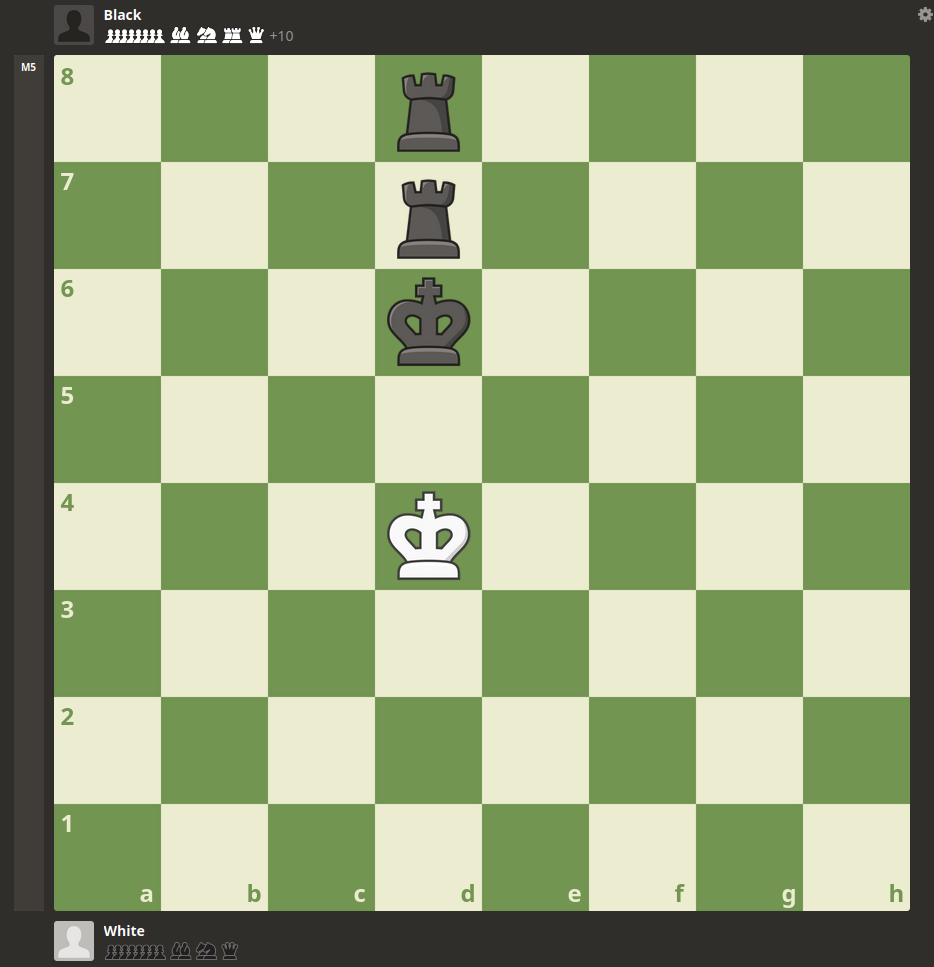
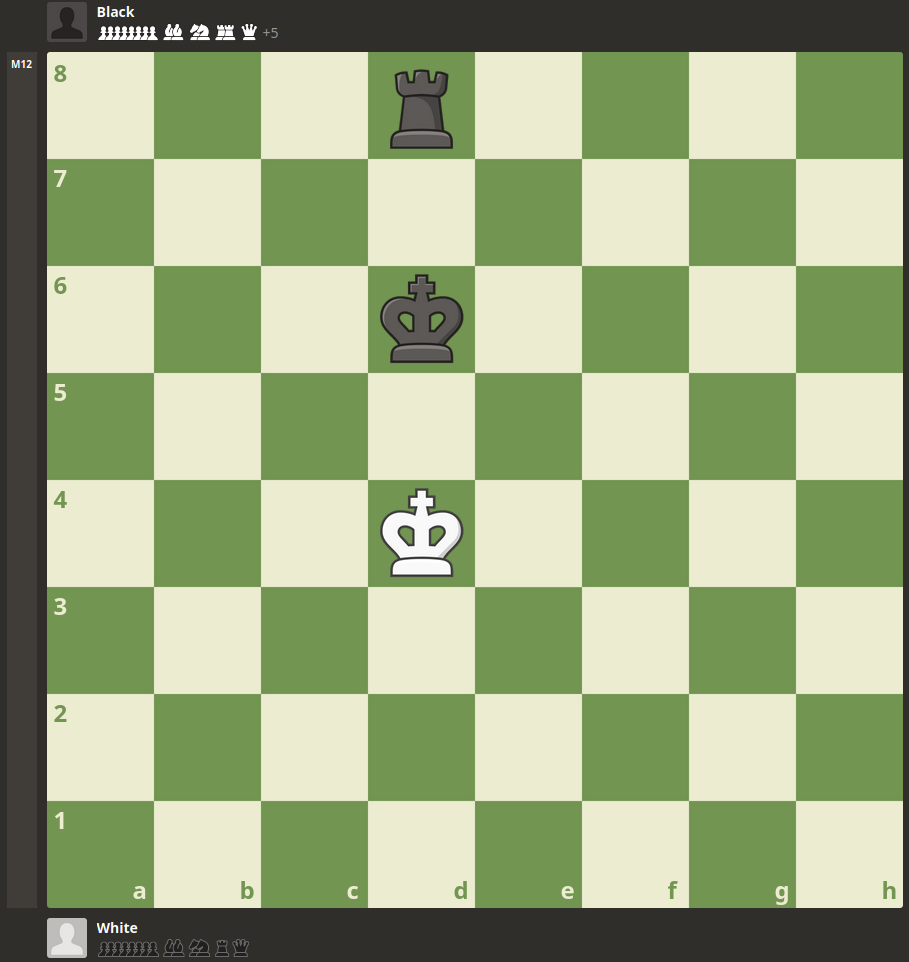

# `puzzle_1.py` for v1.x

> White to Move
```
python3 local_v1_tests/puzzle_1.py --versions v1 v1.1 v1.2 v1.3 v1.4 v1.5 --depth 4 --time-limit-seconds 1.0
```

```
=== v1 experiment at depth 4 ===
Start FEN: 8/8/6kp/3b4/1p1p4/1P1P3P/PK2N3/8 w - - 0 2
White 1: Nf4+ (e2f4) | expected=Nf4+ | match=True | score=-100 | positions=53034 | elapsed=13.264232s
Black forced: Kg7 (g6g7)
White 2: Ng6 (f4g6) | expected=Nxd5 | match=False | score=-100 | positions=44195 | elapsed=11.175688s
White total: positions=97229 | elapsed=24.439920s

=== v1.1 experiment at depth 4 ===
Start FEN: 8/8/6kp/3b4/1p1p4/1P1P3P/PK2N3/8 w - - 0 2
White 1: Nf4+ (e2f4) | expected=Nf4+ | match=True | score=400 | positions=6487 | elapsed=1.515693s
Black forced: Kg7 (g6g7)
White 2: Nxd5 (f4d5) | expected=Nxd5 | match=True | score=500 | positions=8009 | elapsed=1.944826s
White total: positions=14496 | elapsed=3.460518s

=== v1.2 experiment at depth 4 ===
Start FEN: 8/8/6kp/3b4/1p1p4/1P1P3P/PK2N3/8 w - - 0 2
White 1: Nf4+ (e2f4) | expected=Nf4+ | match=True | score=400 | positions=4677 | elapsed=1.105808s
Black forced: Kg7 (g6g7)
White 2: Nxd5 (f4d5) | expected=Nxd5 | match=True | score=500 | positions=3135 | elapsed=0.755874s
White total: positions=7812 | elapsed=1.861681s

=== v1.3 experiment at depth 4 ===
Start FEN: 8/8/6kp/3b4/1p1p4/1P1P3P/PK2N3/8 w - - 0 2
White 1: Nf4+ (e2f4) | expected=Nf4+ | match=True | score=400 | positions=7219 | elapsed=2.098121s
Black forced: Kg7 (g6g7)
White 2: Nxd5 (f4d5) | expected=Nxd5 | match=True | score=500 | positions=4865 | elapsed=1.421929s
White total: positions=12084 | elapsed=3.520049s

=== v1.4 experiment at depth 4 ===
Start FEN: 8/8/6kp/3b4/1p1p4/1P1P3P/PK2N3/8 w - - 0 2
White 1: Nf4+ (e2f4) | expected=Nf4+ | match=True | score=400 | positions=5711 | elapsed=1.683939s
Black forced: Kg7 (g6g7)
White 2: Nxd5 (f4d5) | expected=Nxd5 | match=True | score=500 | positions=3701 | elapsed=1.121361s
White total: positions=9412 | elapsed=2.805300s

=== v1.5 experiment at time_limit=1.000s ===
Start FEN: 8/8/6kp/3b4/1p1p4/1P1P3P/PK2N3/8 w - - 0 2
White 1: Nf4+ (e2f4) | expected=Nf4+ | match=True | score=400 | positions=3223 | elapsed=1.000059s
White 1 detail: completed_depth=3 | timed_out=True | tt_entries=444 | tt_probes=1306 | tt_hits=139 | tt_hit_rate=0.106 | tt_cutoffs=6
Black forced: Kg7 (g6g7)
White 2: Nxd5 (f4d5) | expected=Nxd5 | match=True | score=500 | positions=3014 | elapsed=1.000068s
White 2 detail: completed_depth=3 | timed_out=True | tt_entries=354 | tt_probes=1071 | tt_hits=118 | tt_hit_rate=0.110 | tt_cutoffs=3
White total: positions=6237 | elapsed=2.000127s
```

# `endgame_1.py` for v1.4

> Black to Move
```
python3 local_v1_tests/endgame_1.py
```

```
(.venv) benny@benny-X370M-HDV-R4-0:~/Desktop/_gitrepo/chess-flask$ python3 local_v1_tests/endgame_1.py
=== v1.4 endgame self-play at depth 4 ===
Start FEN: 3r4/3r4/3k4/8/3K4/8/8/8 b - - 1 1
Start turn: black | max_plies=60
Ply 1: black to move | legal_moves=18 | depth=4 | search started
Ply 1: black plays Ke6+ (d6e6) | score=1134 | positions=2458 | elapsed=1.601266s
Ply 2: white to move | legal_moves=5 | depth=4 | search started
Ply 2: white plays Ke3 (d4e3) | score=-1150 | positions=6661 | elapsed=2.623213s
Ply 3: black to move | legal_moves=27 | depth=4 | search started
Ply 3: black plays Kf5 (e6f5) | score=1150 | positions=3981 | elapsed=2.576500s
Ply 4: white to move | legal_moves=3 | depth=4 | search started
Ply 4: white plays Kf3 (e3f3) | score=-1179 | positions=3630 | elapsed=1.391160s
Ply 5: black to move | legal_moves=25 | depth=4 | search started
Ply 5: black plays Rd2 (d7d2) | score=1179 | positions=5890 | elapsed=4.238186s
Ply 6: white to move | legal_moves=2 | depth=4 | search started
Ply 6: white plays Kg3 (f3g3) | score=-inf | positions=87 | elapsed=0.030850s
Ply 7: black to move | legal_moves=31 | depth=4 | search started
Ply 7: black plays R8d3+ (d8d3) | score=inf | positions=4349 | elapsed=2.880582s
Ply 8: white to move | legal_moves=1 | depth=4 | search started
Ply 8: white plays Kh4 (g3h4) | score=-inf | positions=2 | elapsed=0.000411s
Ply 9: black to move | legal_moves=26 | depth=4 | search started
Ply 9: black plays Rh2# (d2h2) | score=inf | positions=1475 | elapsed=0.911392s

Final FEN: 8/8/8/5k2/7K/3r4/7r/8 w - - 10 6
Total positions: 28533
Outcome: Outcome(termination=<Termination.CHECKMATE: 1>, winner=False)
Winner: black
Repetition detected: False
Black delivered mate without repetition: True
```

# `endgame_2.py` for v1.4

> Black to Move
```
python3 local_v1_tests/endgame_2.py
```

```
=== v1.4 endgame self-play at depth 4 ===
Start FEN: 3r4/8/3k4/8/3K4/8/8/8 b - - 1 1
Start turn: black | max_plies=60
Ply 1: black to move | legal_moves=13 | depth=4 | search started
Ply 1: black plays Re8 (d8e8) | score=672 | positions=2007 | elapsed=1.051894s
Ply 2: white to move | legal_moves=3 | depth=4 | search started
Ply 2: white plays Kc3 (d4c3) | score=-691 | positions=3402 | elapsed=1.203701s
Ply 3: black to move | legal_moves=22 | depth=4 | search started
Ply 3: black plays Kc5 (d6c5) | score=687 | positions=3400 | elapsed=1.796127s
Ply 4: white to move | legal_moves=5 | depth=4 | search started
Ply 4: white plays Kd3 (c3d3) | score=-717 | positions=3851 | elapsed=1.346782s
Ply 5: black to move | legal_moves=20 | depth=4 | search started
Ply 5: black plays Kd5 (c5d5) | score=696 | positions=2431 | elapsed=1.365276s
Ply 6: white to move | legal_moves=3 | depth=4 | search started
Ply 6: white plays Kc3 (d3c3) | score=-720 | positions=2365 | elapsed=0.940760s
Ply 7: black to move | legal_moves=20 | depth=4 | search started
Ply 7: black plays Re3+ (e8e3) | score=703 | positions=2828 | elapsed=1.492363s
Ply 8: white to move | legal_moves=4 | depth=4 | search started
Ply 8: white plays Kc2 (c3c2) | score=-726 | positions=2251 | elapsed=0.852043s
Ply 9: black to move | legal_moves=22 | depth=4 | search started
Ply 9: black plays Kc4 (d5c4) | score=719 | positions=3081 | elapsed=1.669753s
Ply 10: white to move | legal_moves=5 | depth=4 | search started
Ply 10: white plays Kd2 (c2d2) | score=-755 | positions=2478 | elapsed=0.884619s
Ply 11: black to move | legal_moves=20 | depth=4 | search started
Ply 11: black plays Re8 (e3e8) | score=737 | positions=1588 | elapsed=0.853126s
Ply 12: white to move | legal_moves=3 | depth=4 | search started
Ply 12: white plays Kc1 (d2c1) | score=-767 | positions=1634 | elapsed=0.686755s
Ply 13: black to move | legal_moves=22 | depth=4 | search started
Ply 13: black plays Kc3 (c4c3) | score=781 | positions=2252 | elapsed=1.268973s
Ply 14: white to move | legal_moves=2 | depth=4 | search started
Ply 14: white plays Kd1 (c1d1) | score=-inf | positions=383 | elapsed=0.162611s
Ply 15: black to move | legal_moves=20 | depth=4 | search started
Ply 15: black plays Re7 (e8e7) | score=inf | positions=935 | elapsed=0.545740s
Ply 16: white to move | legal_moves=1 | depth=4 | search started
Ply 16: white plays Kc1 (d1c1) | score=-inf | positions=2 | elapsed=0.000287s
Ply 17: black to move | legal_moves=19 | depth=4 | search started
Ply 17: black plays Re1# (e7e1) | score=inf | positions=1204 | elapsed=0.655150s

Final FEN: 8/8/8/8/8/2k5/8/2K1r3 w - - 18 10
Total positions: 36092
Outcome: Outcome(termination=<Termination.CHECKMATE: 1>, winner=False)
Winner: black
Repetition detected: False
Black delivered mate without repetition: True
```